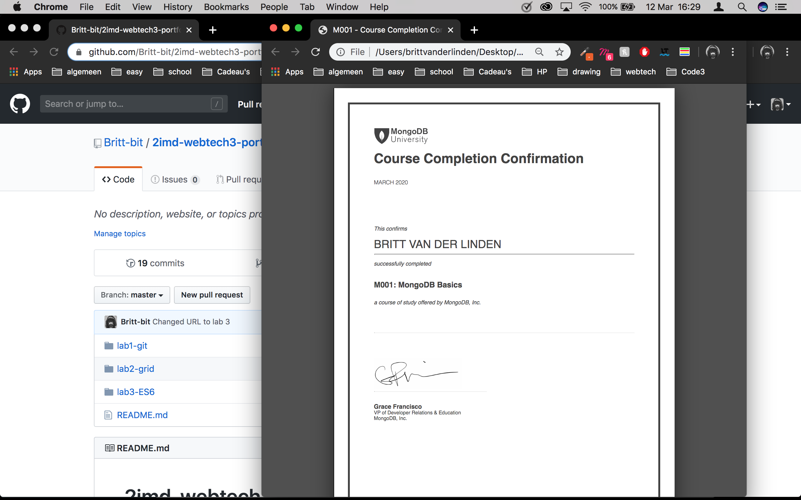

# 2imd-webtech3-portfolio

[Lab 1](https://github.com/Britt-bit/2imd-webtech3-portfolio/tree/master/lab1-git)

[Lab 2](https://github.com/Britt-bit/2imd-webtech3-portfolio/tree/master/lab2-grid)

[Lab 3](https://github.com/Britt-bit/2imd-webtech3-portfolio/tree/master/lab3-ES6)

[Lab 4](https://github.com/Britt-bit/2imd-webtech3-portfolio/tree/master/lab4-api)

[Lab 5](https://github.com/Britt-bit/2imd-webtech3-lab5-try2)

Completion mongoDB:

